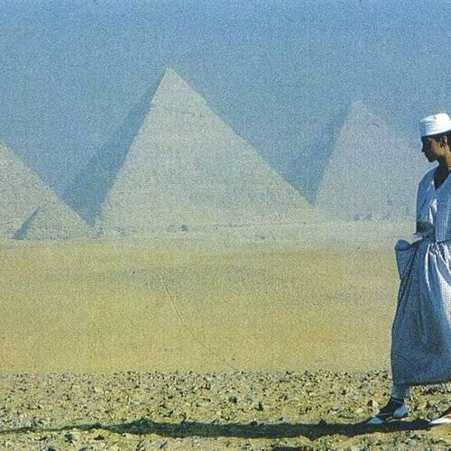

<AudioPlayer source={'https://traffic.libsyn.com/reverberationradio/Reverberation_296.mp3'} />

<b><a href="https://traffic.libsyn.com/reverberationradio/Reverberation_296.mp3">Reverberation #296</a> </b>1. Johnny Colon &amp; Orchestra - Boogaloo Blues 2. Sun Ra - Enlightenment 3. Charles Bradley - You Put The Flame On It 4. Menahan Street Band - Since Our Last Goodbye 5. Howlin&rsquo; Wolf - Spoonful 6. Gerry Rafferty - Big Change In The Weather (Demo) 7. Caetano Veloso, Joa&#771;o Gilberto E Gilberto Gil - Milagre

