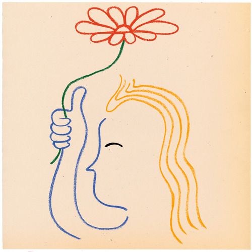

<AudioPlayer source={'http://traffic.libsyn.com/reverberationradio/Reverberation_297.mp3'} />

<a href="http://traffic.libsyn.com/reverberationradio/Reverberation_297.mp3"><b>Reverberation #297</b></a><b> </b>1. J.G. Ballard meet Horoumi Hosono 2. Robert Wyatt - Heaps Of Sheeps 3. Ashra - Oasis 4. Sun Ra - Door To The Cosmos ( Motor City Drum Ensemble Remix) 5. Jackie Mittoo - Oboe 6. Tin Pan Alley - She Is Gone 7. Maston - Infinite Bliss 8. Roberto Musci - Claudia, Wilhelm R And Me 9. Alematehu Eshete &ndash; Afer Yemegnshale 10. Yishak Banjaw - Libey Ma'aduley 11. Os Mulheres Negras - M&atilde;oscolorida

