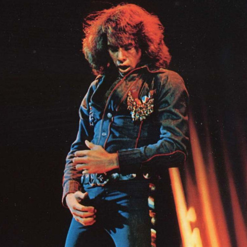

<AudioPlayer source={'https://traffic.libsyn.com/reverberationradio/Reverberation_301.mp3'} />

<a href="https://traffic.libsyn.com/reverberationradio/Reverberation_301.mp3"><b>Reverberation #301</b></a> 1. Lenny Breau - It Could Happen To You 2. Bobby Charles &amp; Rick Danko - New Mexico 3. Barry Goldberg - Another Day 4. Equipe 84 - Sei Gia' Di Un Altro 5. Shagrat - Amanda 6. Keith Christmas - Traveling Down 7. Kazuhiko Kato - Arthur Hakase No Jinriki Hikouki 8. Tommy Peltier - Oneness 9. Kourosh Yaghmaei - Dar Enteha 10. Johnny Thunders - Society Makes Me Sad

