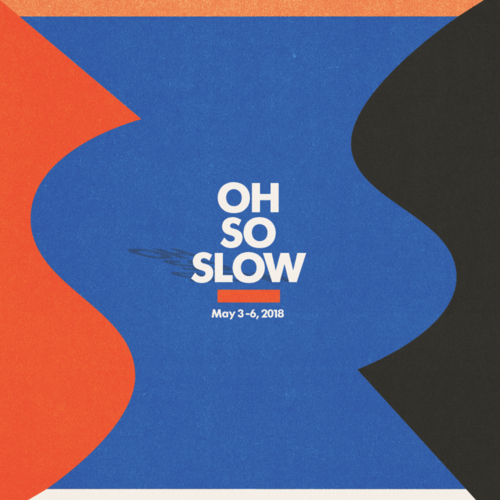

<AudioPlayer source={'https://traffic.libsyn.com/reverberationradio/Oh_so_slow.mp3'} />

<b><a href="https://traffic.libsyn.com/reverberationradio/Oh_so_slow.mp3">Oh So Slow</a></b><b> </b>1. Hiroshi Sato - Evening Shadows &nbsp; 2. Miharu Koshi - Scandal Night 3. Buffalo Daughter - Oui Oui 4. <a>Patrick Cowley</a> - Somebody to Love Tonight 5. <a>Haruomi Hosono</a> - Aiwoiwaiaou 6. Al Charles - Outstanding  7. The Continentals - I&rsquo;m Ready To Get Down 8. Starlight - Picnicing&nbsp;  Announcing <b><a href="http://tikirocket.com/oh-so-slow">Oh So Slow</a>&nbsp;</b>debut festival -- three days of Art, Film and Music in Canggu, Bali, Indonesia. May 3 - 6, 2018. Full lineup and details to be announced soon at <a href="www.TikiRocket.com"><b>www.TikiRocket.com</b></a> 

