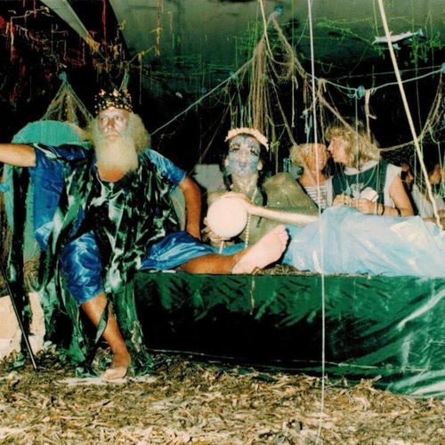

<AudioPlayer source={'http://traffic.libsyn.com/reverberationradio/Reverberation_314.mp3'} />

<b><a href="http://traffic.libsyn.com/reverberationradio/Reverberation_314.mp3">Reverberation #314</a></b> 1. Peter Martin &amp; Finch - D 13 2. Annette B - I Found Love 3. Jorge Ben - Curumin Chama Cunhata 4. Richard Schneider Jr. - Regina&rsquo;s Dance  5. Mario Acquaviva - Notturno Italiano 6. Clout - Sunshine Baby 7. La P&rsquo;tite Fred - &nbsp;Stormy Love Affair 8. Guru Guru - Taoma 9. Pino Donaggio - Telescope 10. Booker T. Jones &amp; Rita Coolidge - We Could Stay Together  11. Santo - Low Tide  12. Flayer - Wanna Get Back Your Love @_Beachyhead 

