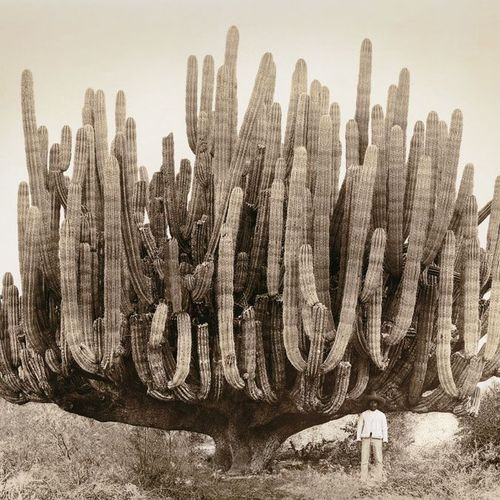

<AudioPlayer source={'https://traffic.libsyn.com/reverberationradio/Reverberation_316.mp3'} />

<a href="https://traffic.libsyn.com/reverberationradio/Reverberation_316.mp3"><b>Reverberation #316</b></a><b> </b>1. Secos &amp; Molhados - Sangue Latino 2. Elia y Elizabeth - Todo En La Vida 3. Los Beats - Porque Llorar 4. Grupo San Miguel - Escribeme Una Carta 5. Grupo San Miguel - Cuando Apenas Era Un Jovencito 6. Hielo Ardiente - Mensaje 7. Los Apson - Fue En Un Cafe 8. Los Beats - Veronica 9. Juancho Vargas - Pesares (S-Dawg Edit) 10. L&ocirc; Borges - Song For My Father 11. Los Destellos - Valicha

