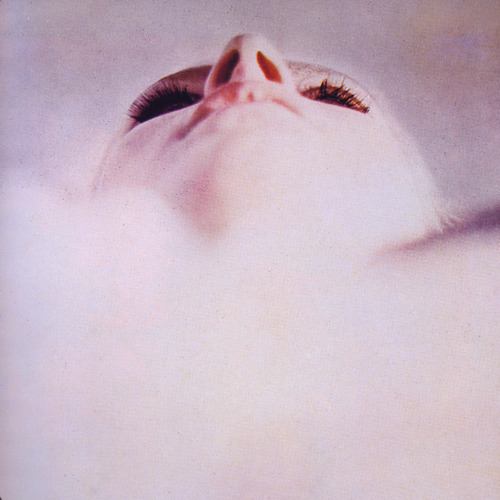

<AudioPlayer source={'http://traffic.libsyn.com/reverberationradio/Reverberation_317.mp3'} />

<a href="http://traffic.libsyn.com/reverberationradio/Reverberation_317.mp3"><b>Reverberation #317</b></a> 1. Juan Pablo Torres y Algo Nuevo - Son a Propulsion 2. Amon D&uuml;&uuml;l II - Light 3. Hugh Masekela - You Just Keep Me Hanging On 4. Mad Walls - You Really Think So 5. Yasuaki Shimizu - Seiko 1 6. Disco &amp; Co. Vol. 1 - Life &amp; Fun 7. Ajukaja - Benga Benga 8. Jean-Pierre Decerf - The Cool Brain 9. ORM - P&aacute;sky Z C&iacute;vek Odv&iacute;j&iacute;m 10. George Ohtsuka Quintet - Loving You 

