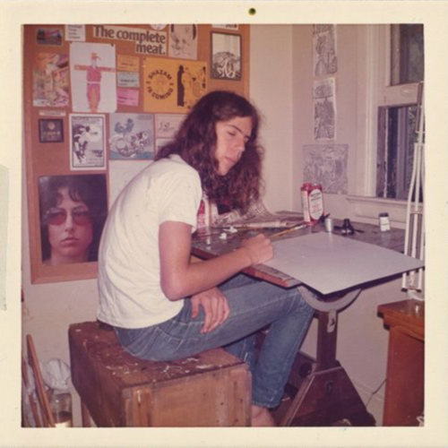

<AudioPlayer source={'https://traffic.libsyn.com/reverberationradio/Reverberation_322.mp3'} />

<b><a href="https://traffic.libsyn.com/reverberationradio/Reverberation_322.mp3">Reverberation #322</a></b> 1. H&aring;kan Hellstr&ouml;m - Du gamla (That's Alright Since My Soul Got A Seat Up In the Kingdom) 2. David Kilgour - Uplift 3. John Cale - Buffalo Ballet 4. Sandy Denny - Listen, Listen 5. Loren Connors - Airs no. 1 6. Chris Bell - You and Your Sister 7. Ted Hawkins - I Gave Up All I Had 8. David Blue - The Street 9. Terry Allen - The Beautiful Waitress 10. Bridget St. John - Song to Keep You Company

