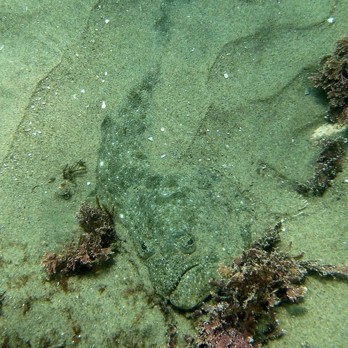

<AudioPlayer source={'http://traffic.libsyn.com/reverberationradio/Reverberation_323.mp3'} />

<a href="http://traffic.libsyn.com/reverberationradio/Reverberation_323.mp3"><b>Reverberation #323</b></a> 1. Pepe Maina - Il Canto Dell'Arpa E Del Flauto (Prima Parte) 2. Jorge Santana - Love The Way 3. Frank Harris and Maria Marquez - Loveroom 4. Usje Sukatma - Waiting for your love 5. Str&ouml;er - Don't Stay For Breakfast} 6. Sandy Samuel - I Like Sado Music (Part 1) 7. Tommy Mandel - Allow Me 8. Brenda Ray - Please Be Mine Tonight

