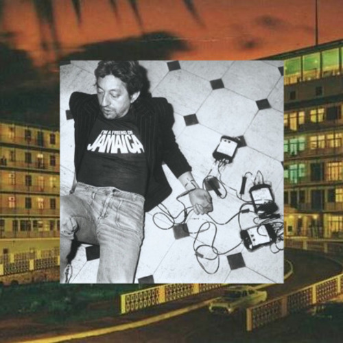

<AudioPlayer source={'https://traffic.libsyn.com/reverberationradio/Reverberation_326.mp3'} />

<b><a href="https://traffic.libsyn.com/reverberationradio/Reverberation_326.mp3">Reverberation #326</a> <b><i>Reverberation Radio Presents: </i>Casual Water / An Aquarium Drunkard Summer Soak</b> </b>1. King Tubby &amp; Yabbu U - Conquering Dub (Excerpt) 2. Serge Gainsbourg - Javanaise Remake 3. Rikki Ililonga - Fire High 4. Monomono - Give A Beggar A Chance 5. Luiz Melodia - Baby Rose 6. Bob Chance - Jungle Talk 7. Ryo Kawasaki - Hawaiian Caravan 8. Brian Eno &amp; David Byrne - Regiment 9. Basa Basa - African Soul Power (Excerpt) 10. Talking Heads - Fela&rsquo;s Riff (Unfinished Outtake) 11. Serge Gainsbourg - Des Laids Des Dubs (Excerpt) 12. Shintaro Sakamoto - From The Dead 7&rdquo; 13. John Holm - Du E En Stor Grabb Nu

