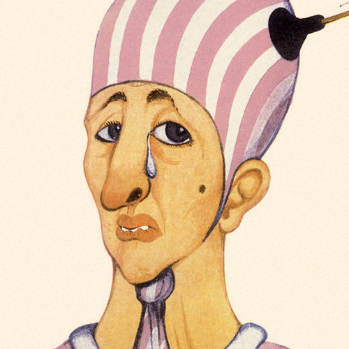

<AudioPlayer source={'http://traffic.libsyn.com/reverberationradio/Reverberation_327.mp3'} />

<b><a href="http://traffic.libsyn.com/reverberationradio/Reverberation_327.mp3">Reverberation #327</a></b> 1. Los Gatos - La Balsa 2. Los Abuelos De La Nada - Llovera 3. Miguel Abuelo - Hoy Seremos Campesinos 4. Vox Dei - Sin Separarnos Mas 5. Almendra - Metizo 6. Spinetta - Todas Las Ojas Son Del Viento 7. Color Humano - Silbame, Oh cabeza 8. Vox Dei - Genesis 9. Tanguito - Amor De Primavera @freejazzpizza 

