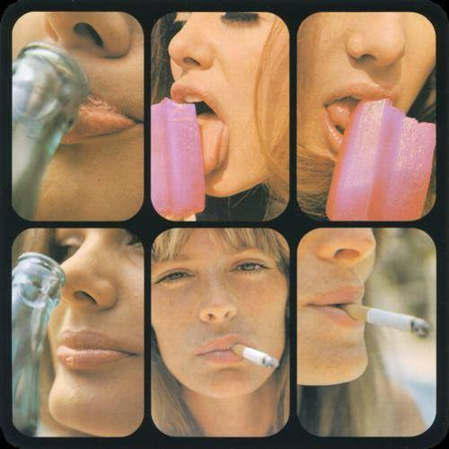

<AudioPlayer source={'http://traffic.libsyn.com/reverberationradio/Reverberation_330.mp3'} />

<a href="http://traffic.libsyn.com/reverberationradio/Reverberation_330.mp3"><b>Reverberation #330</b></a><b> </b>1. Nostalgia 77 - Cheney Lane 2. Michael White - The Blessing Song 3. Ernie Hawks &amp; The Soul Investigators - Cold Turkey Time 4. Hamid El Shaeri - Ayonha 5. The Soundcarriers - Let It Ride 6. Mind Gamers - Come To America 7. Bobby Oroza - This Love 8. Gil Scott-Heron - Your Daddy Loves You

