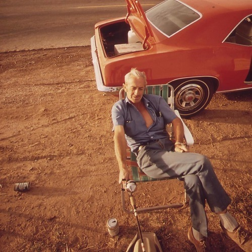

<AudioPlayer source={'http://traffic.libsyn.com/reverberationradio/Reverberation_336.mp3'} />

<b><a href="http://traffic.libsyn.com/reverberationradio/Reverberation_336.mp3" target="_blank">Reverberation #336</a></b> 1. Dillard &amp; Clark - Don&rsquo;t Let Me Down 2. Bob Dylan - Bunkhouse Theme 3. Los Tres Caballeros - La Barca 4. Harry Dean Stanton - Cancion Mixteca 5. The Band - Don&rsquo;t Do It 6. Warren Zevon - Accidentally Like A Martyr 7. Mapache - Katie Dear 8. Los Tres Diamantes - Luces En El Puerto 9. Tom Waits - If I Have To Go 10. Harry Nilsson - Easier For Me 11. Tim Hill - Steady Rain

