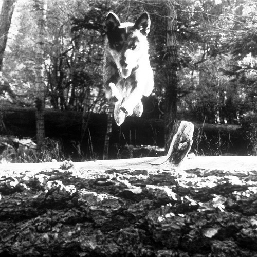

<AudioPlayer source={'https://traffic.libsyn.com/reverberationradio/Reverberation_338.mp3'} />

<b><a href="https://traffic.libsyn.com/reverberationradio/Reverberation_338.mp3">Reverberation #338</a></b> 1. Spirit - Like A Rolling Stone 2. New Riders Of The Purple Sage - Rainbow 3. Chayns - Live with the Moon 4. Ned Doheny - On And On (Demo) 5. Linda Martell - Color Him Father 6. Susan Cadogan - Congratulations 7. Stefano Mora - Chitarre 8. Snapper - Gentle Hour 9. Pink Fairies - Never Never Land

