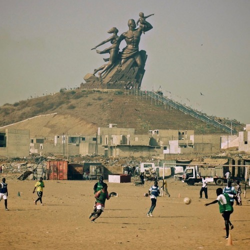

<AudioPlayer source={'https://traffic.libsyn.com/reverberationradio/Reverberation_344.mp3'} />

<a href="https://traffic.libsyn.com/reverberationradio/Reverberation_344.mp3"><b>Reverberation #344</b></a> 1. Willie Colon - Camino Al Barrio 2. Black Disco - Night Express 3. John Cameron - Liquid Sun 4. The Electric Prunes - General Confessions 5. Paragons - When The Lights Are Low 6. Baligh Hamdy - Love Story 7. Leroy Smart - Come Love Me Tonight 8. Ramsey Lewis - Sun Goddess 9. Rahsaan Roland Kirk - Spirits Above

