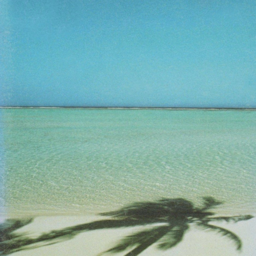

<AudioPlayer source={'http://traffic.libsyn.com/reverberationradio/Reverberation_348.mp3'} />

<a href="http://traffic.libsyn.com/reverberationradio/Reverberation_348.mp3"><b>Reverberation #348</b></a> 1. Anemone - Party Theme 2. Spike - Take It Home 3. PAINT - Splattered 4. Maston - Sure Thing 5. Suncokret - Ni Sam Ne Znam Kada 6. Felt - Silver Plane 7. R. Stevie Moore - Pink Litmus Paper Shirt 8. Jack Adkins - Sunset Beach 9. Mid Day Rain - Welcome To The Rain 10. &#1056;&#1077;&#1076;&#1082;&#1072;&#1103; &#1055;&#1090;&#1080;&#1094;&#1072; - Instrumental 11. John Cale - Bring It On Up

