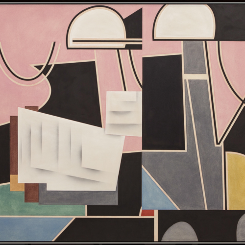

<AudioPlayer source={'https://traffic.libsyn.com/reverberationradio/Reverberation_351.mp3'} />

<a href="https://traffic.libsyn.com/reverberationradio/Reverberation_351.mp3"><b>Reverberation #351</b></a> 1. Angel Rada &nbsp;- Basheeda  2. Alogte Oho &amp; His Sounds of Joy - Mam Yinne Wa 3. Ariel Pink - Nonsequitur Segues  4. Mild High Club &amp; King Gizzard - Countdown 5. Gacaltooyo Band - He Who Does Not Know 6. Bonnie Dobson - Good Morning Rain 7. Arthur Russel - Come To Life 8. Rodney Graham - I'm Running Away To Join The Cirque du Soleil  9. Sound Dimension - Baby Face 

