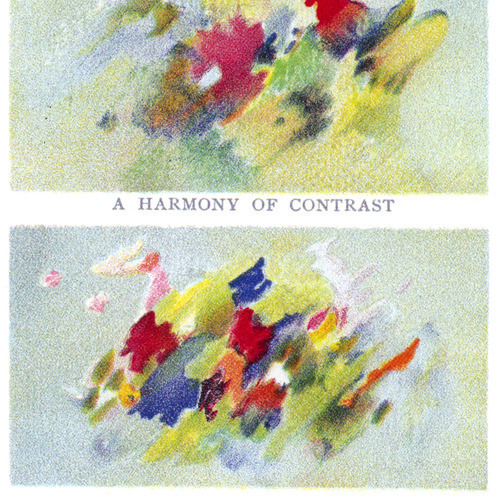

<AudioPlayer source={'http://traffic.libsyn.com/reverberationradio/Reverberation_353.mp3'} />

<b><a href="http://traffic.libsyn.com/reverberationradio/Reverberation_353.mp3">Reverberation #353</a> </b>1. Paul Dally - Pink Eldorado 2. Pedro Santos - Dual 3. Rick Cuevas - The Birds 4. Haroumi Hosono &nbsp;- Pleocene 5. Domenique Dumont - La Bataille De Neige 6. Hematic Sunsets - Crooning Mauer 7. Bacao Rhythm &amp; Steel Band - Xxplosive 8. Salty Miller - One More Time 9. Yusef Lateef - Love Theme from "Spartacus" 10. Reigning Sound - Want You 

