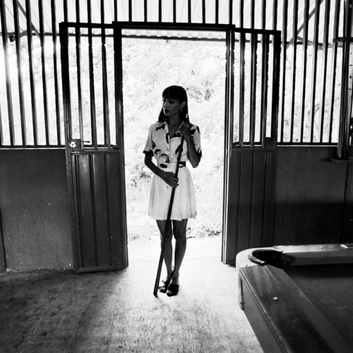

<AudioPlayer source={'https://traffic.libsyn.com/reverberationradio/Reverberation_354.mp3'} />

<b><a href="https://traffic.libsyn.com/reverberationradio/Reverberation_354.mp3">Reverberation #354</a></b> 1. Al Barry &amp; The Cimarons - Morning Sun 2. Susan Cadogan - Hurt So Good 3. Keith &amp; Tex - Hypnotizing Eyes 4. Lyn Taitt &amp; The Comets - Storm Warning 5. Claude Fontaine - Cry For Another 6. Alton Ellis - La La Means I Love You 7. Angela Prince - No Bother With No Fuss 8. John Holt - Riding For a Fall 9. Phyllis Dillon - We Belong Together 10. Cedric Brooks - Father Forgive Him

<a>@claude_fontaine</a> 

