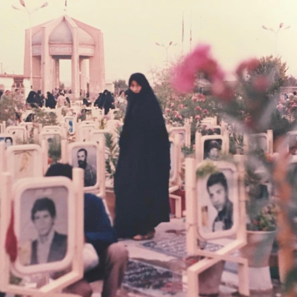

<AudioPlayer source={'http://traffic.libsyn.com/reverberationradio/Reverberation_356.mp3'} />

<a href="http://traffic.libsyn.com/reverberationradio/Reverberation_356.mp3"><b>Reverberation #356</b></a> 1. Paulinho Da Costa - Berimbau Variations 2. Antena - Camino Del Sol 3. Ahmed Malik - La Ville Part 2 4. New Dawn - Life Goes On 5. Lonnie Liston Smith - Sunset 6. Lonnie Holley - All Rendered Truth 7. Sonya Spence - I Love You So 8. Danny &amp; The Dreamers - Eternal Love 9. Harvey Mandel - Cristo Redentor  @radiorahill

