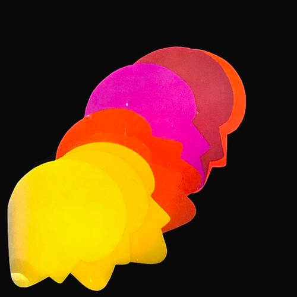

<AudioPlayer source={'https://traffic.libsyn.com/reverberationradio/Reverberation_359.mp3'} />

<b><a href="https://traffic.libsyn.com/reverberationradio/Reverberation_359.mp3">Reverberation #359</a></b> 1. Woo - The English Style of Rowing 2. Domenique Dumont - Le Ch&acirc;teau de Corail 3. Francis Monkman - Stargazing 4. I Mark IV - Tanto Iontano 5. Haroumi Hosono &amp; Miharu Koshi - Hotel Etoiles 6. Tony Rubio - Dead Slow 7. James Clark - Life Cycle 2 8. John Fiddy - Dream Fantasy 9. &nbsp;L&rsquo;Eclair - Coke Mountain 

