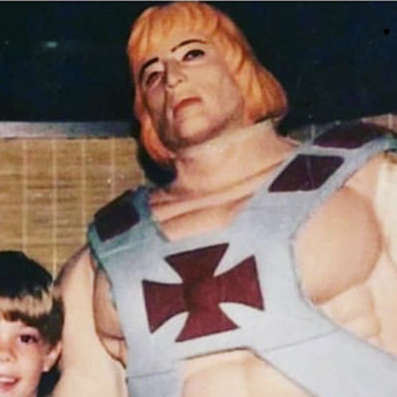

<AudioPlayer source={'https://traffic.libsyn.com/reverberationradio/Reverberation_360.mp3'} />

<a href="http://traffic.libsyn.com/reverberationradio/Reverberation_360.mp3"><b>Reverberation #360</b></a> 1. Phil Lynott - Yellow Pearl 2. Chris Robison - I'm Gonna Stay with My Baby Tonight 3. Whisky David - Preacher 4. Patterson and Pults - Keys (On The Ocean Blue) 5. Ithaca - Bow Down (To The Dollar) 6. The Trash Company - Electra Glide 7. Supermax - Love Machine Part II 8. Blackfoot Sue - Standing In The Road 9. Space - Magic Fly 10. Tiger B. Smith - Morning Bird 

