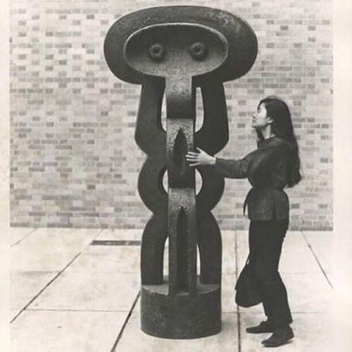

<AudioPlayer source={'https://traffic.libsyn.com/reverberationradio/Reverberation_364.mp3'} />

<b><a href="http://traffic.libsyn.com/reverberationradio/Reverberation_364.mp3">Reverberation #364</a></b> 1. B J Thomas - Circle 'Round The Sun 2. Robert Wyatt - Pigs 3. L&ocirc; Borges - Can&ccedil;&atilde;o Postal 4. Cortex - L'Enfant Samba 5. Gal Costa - Passarinho 6. The Space Lady - Shakin&rsquo; All Over 7. Carla E Marcus - Vento Ver&atilde;o 8. Moondog - Voices Of Spring 9. Usha Iyer - Good Times And Bad Times 10. Fellini - Hist&oacute;ria Do Fogo

