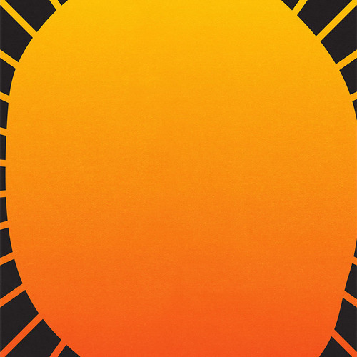

<AudioPlayer source={'https://traffic.libsyn.com/reverberationradio/Reverberation_368.mp3'} />

<a href="https://traffic.libsyn.com/reverberationradio/Reverberation_368.mp3"><b>Reverberation #368</b></a> 1. Tatsuro Yamashita - Bomber 2. Antonio Carlos e Jocafi - Se Quiser Valer 3. Marlena Shaw - Feel Like Makin' Love 4. Mariya Takeuchi - Plastic Love 5. Vaudou Game - Roberto 6. Emilio Santiago - Bananeira 7. Tatsuro Yamashita - Yellow Cab 8. Cristina Camargo - Moral Tem Hora 9. Luciano Perrone - Samba Vocalizado  

<b><i>L I V E &nbsp;T O U R&nbsp; D A T E S</i></b>

Paris, France May 16 Opening Party @pilgrimsurfsupply&nbsp; @ahnaheyewear @thenextdoor

Canggu, Bali, Indonesia May 16-18  <a href="www.OhSoSlow.co">Oh So Slow: Art, Film and Music </a> @the.slow @tikirocket @gimme_shelter_bali

Tokyo, Japan May 23 Opening Party at Pilgrim Surf + Supply @beams_official @brojazz

