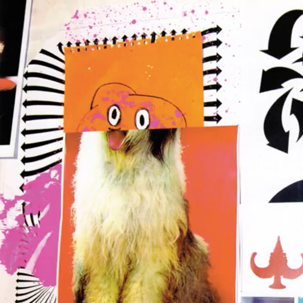

<AudioPlayer source={'https://traffic.libsyn.com/reverberationradio/Reverberation_372.mp3'} />

<a href="https://traffic.libsyn.com/reverberationradio/Reverberation_372.mp3"><b>Reverberation #372</b></a><b> </b>1. George Smallwood &amp; The Marshmellow - Lady Disco Demo 2. Byrne and Barnes - Keep on Running 3. Black Blood - A.I.E. A Mwana ( Edit ) 4. Angela Starr - Boogie Girl 5. Rockmelons - Hypnoteque 6. Club Band - Club Is My Passion (Instrumental) 7. Key West - Wanna Groove 8. Shams Dinn - Hedi Bled Noum 9. Laid Back - East Coast Man

